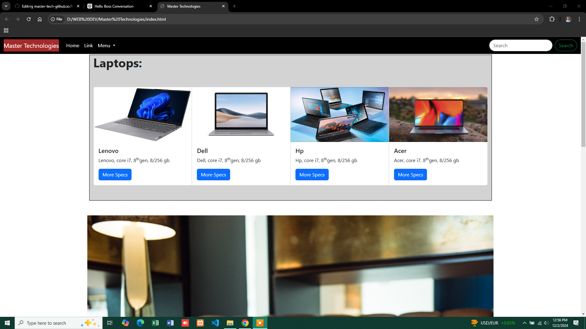
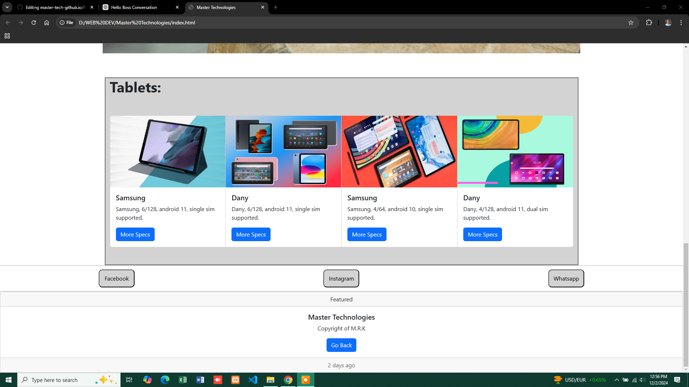

# 💻 Master Technology

Welcome to **Master Technology**, a modern and responsive website designed for laptop and tablet users. Built using HTML, CSS, and JavaScript, this website offers a sleek and user-friendly interface optimized for desktop and tablet screens.

<table>
  <tr>
    <td align="center">
      
    </td>
    <td align="center">
      
    </td>
  </tr>
</table>

---

## Features

- **Laptop & Tablet Showcase**: Explore the best laptop and tablet products with detailed specifications.
- **Responsive Design**: Optimized for both laptops and tablet devices.
- **Search Functionality**: Easily search for products and specifications.
- **Modern UI**: Clean and intuitive interface for a seamless user experience.

---

## Technologies Used

- **HTML5** for structuring the website.
- **CSS3** for styling and responsive layout.
- **JavaScript (ES6)** for interactive features and functionality.

---

